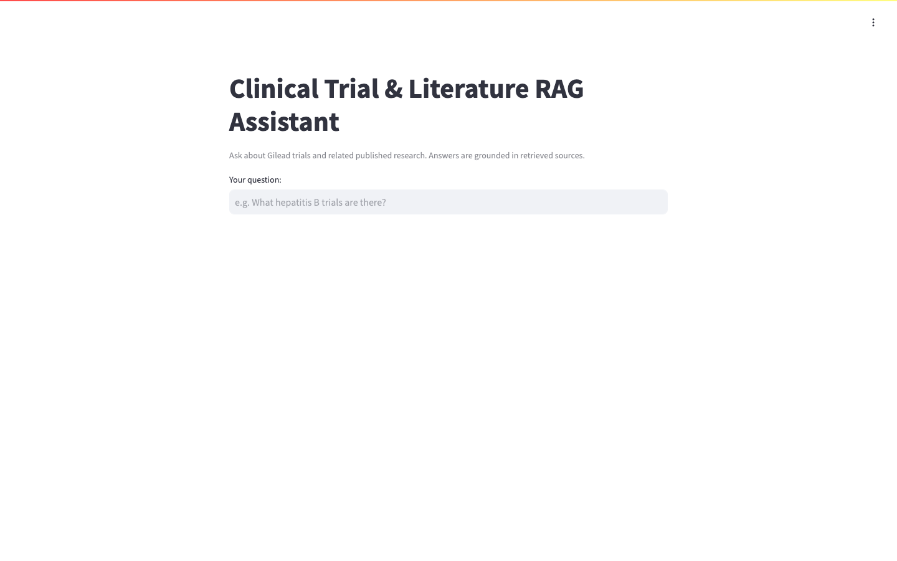
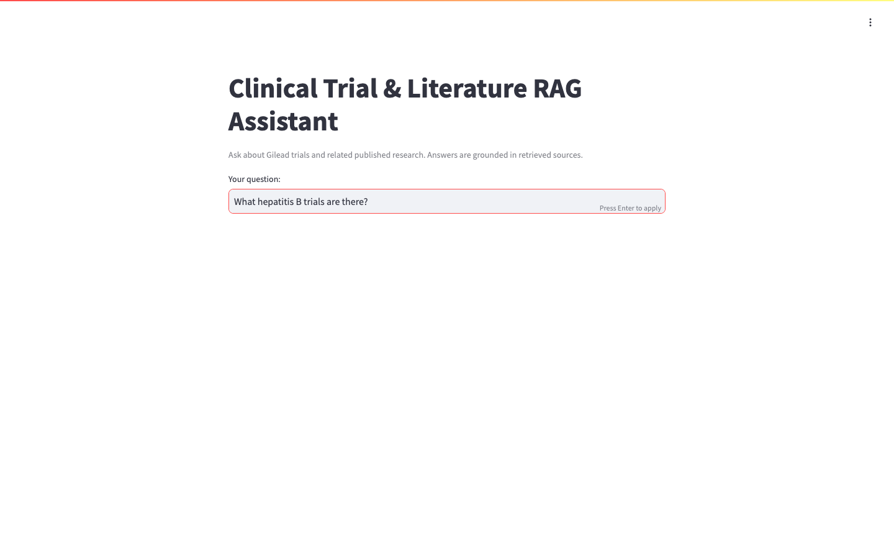
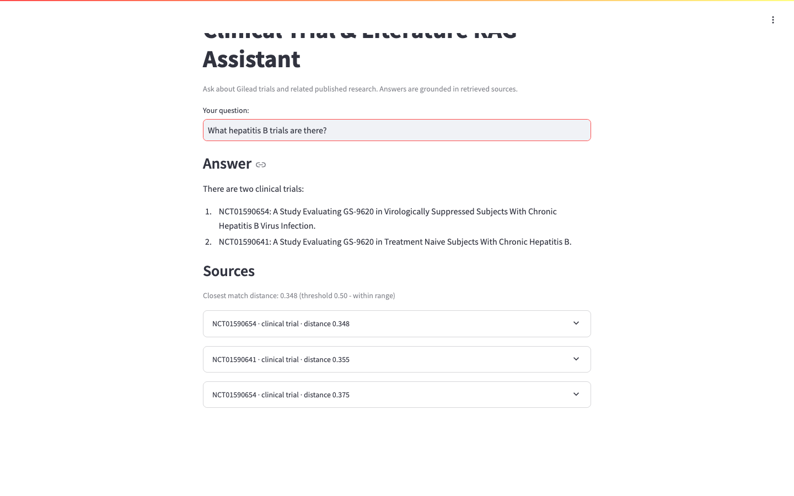
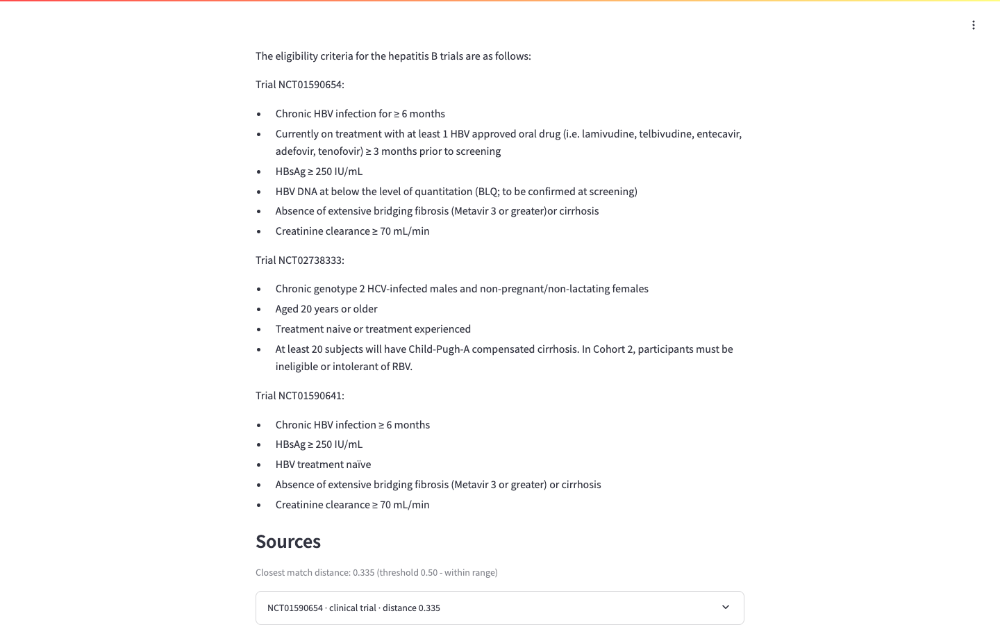

# Clinical Trial & Literature RAG Assistant — Demo

A Retrieval-Augmented Generation (RAG) assistant that answers questions about
Gilead clinical trials and related published research. Every answer is **grounded
in retrieved sources** — the app shows the matching documents and their vector
similarity distances, and it declines to answer when nothing relevant is retrieved.

**Stack:** Streamlit UI · Chroma vector store · Ollama (local LLM) · deployed on AWS ECS Fargate.

---

## Walkthrough

### 1. Landing page
The assistant opens with a single question box.

### 2. Ask a question
Example: *"What hepatitis B trials are there?"*

### 3. Grounded answer with sources
The assistant returns two matching trials (GS-9620) and lists the retrieved
**Sources** with their similarity distances (0.348 / 0.355 / 0.375 — within the 0.50 threshold).

### 4. A second, more detailed query
Example: *"What are the eligibility criteria for the hepatitis B trials?"* — the
assistant pulls structured eligibility criteria for three trials
(NCT01590654, NCT02738333, NCT01590641), again grounded in cited sources.

---

## Video

A short (~22s) silent screen-capture of the walkthrough:

<video src="./ctlit-rag-demo.mp4" controls width="720"></video>

▶️ [Watch `ctlit-rag-demo.mp4`](./ctlit-rag-demo.mp4)

> Note: the on-screen "thinking" pauses were shortened for the demo. The first
> question takes longer because it triggers the Ollama model's cold-load; the
> second question is faster once the model is warm.

---

*Captured from the ECS Fargate deployment. Screenshots are full-resolution (1440×900).*
